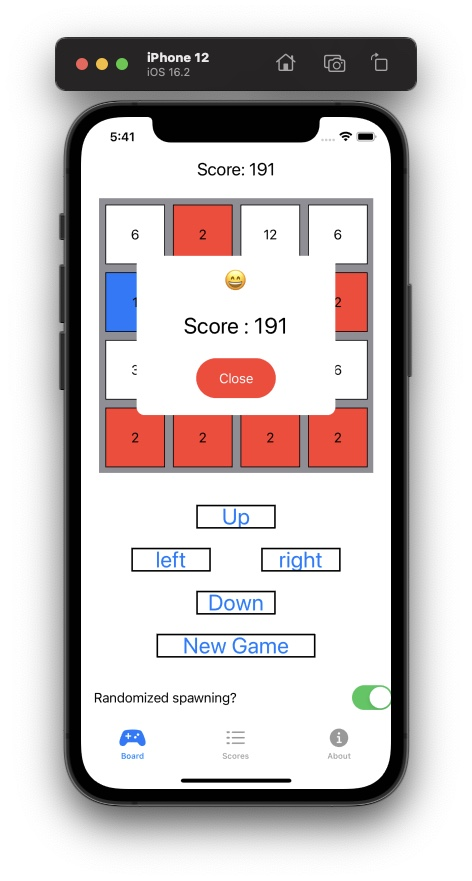

# Overview

This is an empty public repository to show off a school project that was implemented by me using Swift/SwiftUI. This is a simplified clone of the game Threes! on the App Store. 
It is also similar to the game 2048. This app allows the user to perform moves using the buttons on the bottom half of the screen as well as using finger gestures to move the cells.
The game ends when no available moves are detected. The app keeps track of all scores and sorts them in descending order. Randomized spawning is enabled by default and will use a 
random number generator to decide which type of cell to generate and where to spawn it. Landscape and portrait modes have been implemented.

Images of the completed version can be seen below.

Due to academic integrity rules, the code will remain hidden in a private repository. 

# Images

## Start of game

## Example game

## Landscape mode

## Score popup and high score tracker

